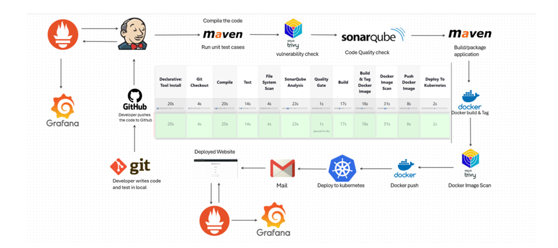

# 🚀 CI/CD Pipeline Automation – Mahipal Singh Jhala

This project implements a complete CI/CD pipeline using Jenkins, Docker, Trivy, SonarQube, Kubernetes, Prometheus, and Grafana on AWS EC2. It automates the entire workflow from code commit to container deployment with integrated testing, security scanning, and monitoring.

---

## 📐 Architecture

| Instance | Services |
|----------|----------|
| 1        | Jenkins, Maven, SonarQube (Docker), Trivy, Node Exporter |
| 2        | Kubernetes Master Node |
| 3        | Kubernetes Worker Node |
| 4        | Prometheus, Grafana, Blackbox Exporter |

---

## 🔁 Pipeline Workflow

1. Code pushed to GitHub → triggers Jenkins pipeline via webhook
2. Jenkins stages:
   - Git checkout
   - Maven build & unit tests
   - Trivy vulnerability scan
   - SonarQube code quality check
   - Docker image build & push
   - Kubernetes deployment
3. Monitoring via Grafana + Prometheus
4. Email notification on build success/failure

---

## 📂 Project Files

- `Jenkinsfile`: Defines all pipeline stages
- `Dockerfile`: For building the app container
- `manifests/`: Kubernetes deployment and service YAMLs
- `prometheus/`: Prometheus and exporter config files
- `trivy-reports/`: Trivy scan reports and summaries
- `screenshots/`: Pipeline execution screenshots

---

## 🔒 Trivy Report Summary

### 📦 Container Image (mahipalsinghjhala/devproject:latest – Ubuntu 20.04)
- **Total Vulnerabilities:** 8
- **Severity Breakdown:**
  - LOW: 0
  - MEDIUM: 8
  - HIGH: 0
  - CRITICAL: 0

### Example:
| Library     | Vulnerability | Severity | Installed | Fixed | Description |
|-------------|---------------|----------|-----------|-------|-------------|
| libc-bin    | CVE-2025-4802 | MEDIUM   | 2.31-0ubuntu9.17 | 2.31-0ubuntu9.18 | glibc dlopen misuses LD_LIBRARY_PATH |
| libsqlite3-0 | CVE-2025-29088 | MEDIUM  | 3.31.1-4ubuntu0.6 | 3.31.1-4ubuntu0.7 | SQLite DoS vulnerability |

Full report available in `trivy-reports/trivy-report.json`

---

## 📊 Monitoring Dashboards

- Prometheus collects metrics from Jenkins, Kubernetes, Node Exporter, and Blackbox Exporter
- Grafana displays:
  - Jenkins build stats
  - Node and pod resource usage
  - Uptime/availability checks via Blackbox

---

## 📸 Screenshots

Refer to the `screenshots/` folder for:
- Jenkins pipeline execution
- Trivy scan results
- SonarQube quality gate
- Prometheus targets
- Grafana dashboards

---

## 🧠 Learnings

- CI/CD orchestration using Jenkins pipelines
- Securing Docker builds using Trivy
- Code quality automation using SonarQube
- Deploying apps on Kubernetes clusters
- Infrastructure monitoring with Prometheus & Grafana

---

## 👨‍💻 Author

**Mahipal Singh Jhala**  
📧 mahipalsinghjhala707@gmail.com  
🔗 [GitHub](https://github.com/MahipalSinghJhala707)
